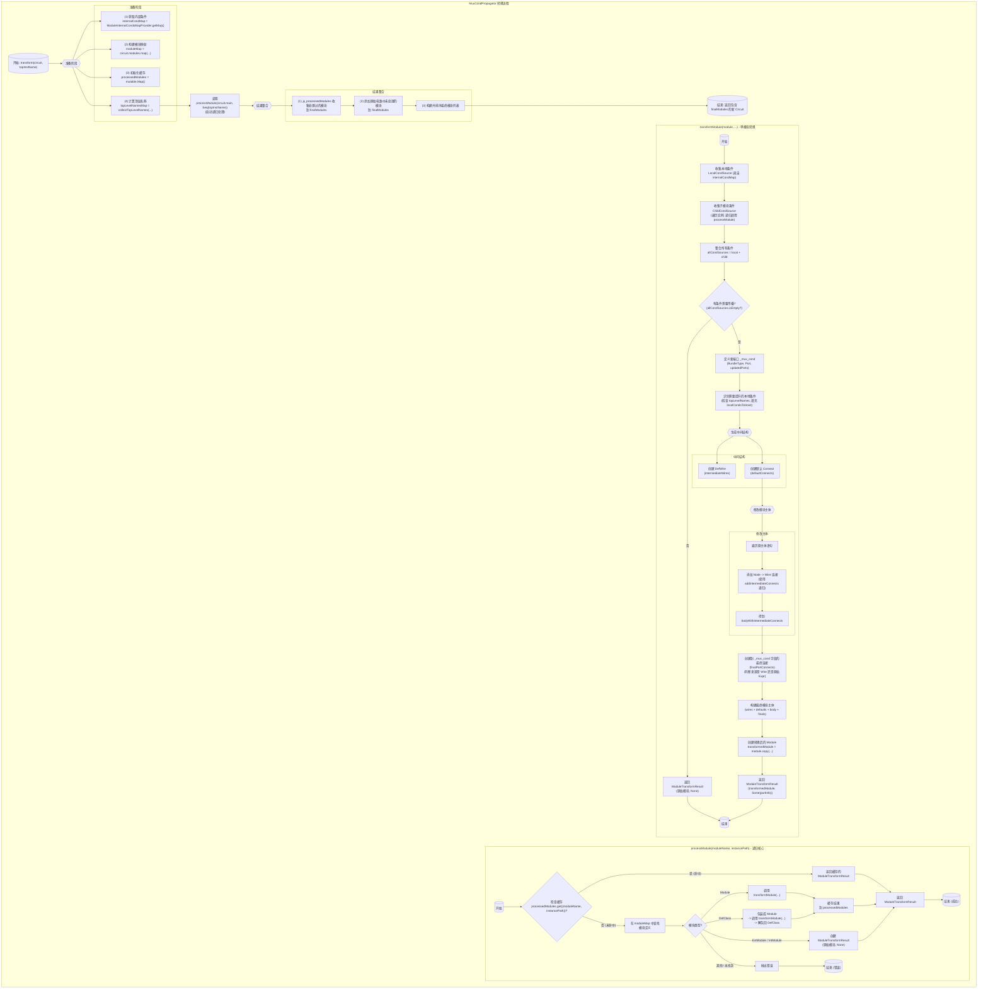

```mermaid
graph TD
    subgraph "MuxCondPropagator 转换流程"
        A[("开始: transform(circuit, topInstName)")] --> B{{"准备阶段"}};
            subgraph "准备阶段"
                B1["(1) 获取内部条件<br/>internalCondMap = ModuleInternalCondsMapProvider.getMap()"]
                B2["(2) 构建模块映射<br/>moduleMap = circuit.modules.map(...)"]
                B3["(3) 初始化缓存<br/>processedModules = mutable.Map()"]
                B4["(4) 计算顶层名称<br/>topLevelNamesMap = collectTopLevelNames(...)"]
            end
        B --> B1 & B2 & B3 & B4;
        B4 --> C["调用<br/>processModule(circuit.main, Seq(topInstName))<br/>(启动递归处理)"];

        C --> D{{"结果整合"}};
            subgraph "结果整合"
                D1["(1) 从 processedModules 收集处理过的模块<br/>到 finalModules"]
                D2["(2) 添加原始电路中未处理的模块<br/>到 finalModules"]
                D3["(3) 构建并排序最终模块列表"]
            end
        D --> D1 --> D2 --> D3;
        D3 --> E[("结束: 返回包含 finalModules 的新 Circuit")];

    subgraph "processModule(moduleName, instancePath) - 递归核心"
        direction LR
        PM_A[("开始")] --> PM_B{"检查缓存<br/>processedModules.get((moduleName, instancePath))?"};
        PM_B -- "是 (命中)" --> PM_C["返回缓存的<br/>ModuleTransformResult"];
        PM_B -- "否 (未命中)" --> PM_D["在 moduleMap 中查找<br/>模块定义"];
        PM_D --> PM_E{模块类型?};
        PM_E -- "Module" --> PM_F["调用<br/>transformModule(...)"];
        PM_E -- "DefClass" --> PM_G["包装成 Module<br/>-> 调用 transformModule(...)<br/>-> 解包回 DefClass"];
        PM_E -- "ExtModule / IntModule" --> PM_H["创建 ModuleTransformResult<br/>(原始模块, None)"];
        PM_E -- "其他 / 未找到" --> PM_I["抛出错误"];
        PM_F --> PM_J["缓存结果<br/>到 processedModules"];
        PM_G --> PM_J;
        PM_H --> PM_K["返回 ModuleTransformResult"];
        PM_J --> PM_K;
        PM_C --> PM_K;
        PM_I --> PM_End[("结束 (错误)")];
        PM_K --> PM_EndOK[("结束 (成功)")];
    end

    subgraph "transformModule(module, ...) - 单模块转换"
        TM_A[("开始")] --> TM_B["收集本地条件<br/>LocalCondSource (来自 internalCondMap)"];
        TM_B --> TM_C["收集子模块条件<br/>ChildCondSource<br/>(遍历实例, 递归调用 processModule)"];
        TM_C --> TM_D["整合所有条件<br/>allCondSources = local + child"];
        TM_D --> TM_E{"有条件需要传播?<br/>(allCondSources.isEmpty?)"};
        TM_E -- "否" --> TM_F["返回 ModuleTransformResult<br/>(原始模块, None)"];
        TM_E -- "是" --> TM_G["定义新端口 _mux_cond<br/>(BundleType, Port, updatedPorts)"];
        TM_G --> TM_H["识别需要提升的本地条件<br/>(检查 topLevelNames, 填充 localCondsToHoist)"];
        TM_H --> TM_I{{"生成中间结构"}};
            subgraph "中间结构"
                TM_I1["创建 DefWire<br/>(intermediateWires)"]
                TM_I2["创建默认 Connect<br/>(defaultConnects)"]
            end
        TM_I --> TM_I1 & TM_I2;
        TM_I2 --> TM_J{{"修改模块主体"}};
                subgraph "修改主体"
                    TM_J1["遍历原主体语句"]
                    TM_J2["添加 Node -> Wire 连接<br/>(使用 addIntermediateConnects 递归)"]
                    TM_J3["得到 bodyWithIntermediateConnects"]
                end
            TM_J --> TM_J1 --> TM_J2 --> TM_J3;
        TM_J3 --> TM_K["创建到 _mux_cond 字段的最终连接<br/>(finalPortConnects)<br/>(判断来源是 Wire 还是原始 Expr)"];
        TM_K --> TM_L["构建最终模块主体<br/>(wires + defaults + body + finals)"];
        TM_L --> TM_M["创建转换后的 Module<br/>transformedModule = module.copy(...)"];
        TM_M --> TM_N["返回 ModuleTransformResult<br/>(transformedModule, Some(portInfo))"];
        TM_F --> TM_End[("结束")];
        TM_N --> TM_End;
    end
    end
```