# Chisel 覆盖率工具

## 项目简介

本项目提供了一个基于 Chisel 和 FIRRTL 的工具，用于自动提取 Chisel 设计中的特定覆盖点（目前支持 `when`/`else when` 语句的谓词、`Mux` 表达式的条件以及所有寄存器的值），并将这些信号传播到顶层模块。然后，它会生成配套的 C++ 代码和一个 Bash 脚本，以便使用 Verilator 进行仿真，并在仿真过程中收集这些覆盖点的信息，最终生成覆盖率报告（控制台输出和 JSON 文件）。

主要目标是辅助开发者了解在仿真过程中，设计的哪些条件分支被触发，哪些 Mux 选择被使用，以及寄存器的值变化情况，从而帮助评估测试向量的完备性。

## 功能对比

| **对比维度**     | **Chisel (硬件构造语言)**                                                | **Verilator (仿真工具)**                                           | **Chisel Coverage Tool**                                                                                        |
| ---------------- | ------------------------------------------------------------------------ | ------------------------------------------------------------------ | --------------------------------------------------------------------------------------------------------------- |
| **核心功能**     | 基于 Scala 的 RTL 生成框架，支持硬件抽象设计与参数化模块构造             | 将 Verilog 转换为优化的 C++ 仿真模型，提供高性能仿真能力           | 通过 FIRRTL 转换自动提取 Chisel 设计中的条件分支、Mux 路径和寄存器信号，并生成 cpp 测试框架注入覆盖率探针       |
| **覆盖类型**     | 依赖 sbt-scoverage 插件统计 Scala 生成器代码覆盖率，与硬件逻辑无直接关联 | 支持 SystemVerilog 代码行覆盖率（Line Coverage），反映代码执行频率 | 硬件行为级功能覆盖率：<br>• 条件分支命中率（True/False）<br>• Mux 路径选择率<br>• 寄存器位级翻转统计            |
| **验证流程整合** | 无法验证 RTL 设计的覆盖率                                                | 生成 .dat 覆盖率文件，需配合 lcov/genhtml 等工具二次解析           | 全流程自动化：<br>• 生成带覆盖率端口的 SystemVerilog<br>• 集成 C++ 覆盖率收集框架<br>• 一键生成报告与树状可视化 |
| **验证效率瓶颈** | 覆盖率与 RTL 设计无关，无法定位硬件控制流缺陷                            | 行覆盖率无法识别未触发的状态机跳转、多路选择器路径等硬件关键行为   | 基于硬件语义的覆盖率模型可直接暴露设计漏洞（如死锁分支、未使用寄存器位等）                                      |

## 使用说明

1.  **准备 Chisel 模块**: 确保你的 Chisel 模块可以被实例化（例如，继承自 `RawModule` 或 `Module`）。
2.  **配置主程序**: 参考下面的示例代码，在 `main.scala` (或其他主程序文件) 中：
    - 定义一个 `Seq`，包含要处理的模块生成器函数和对应的输出子目录名称。
    - 遍历这个 `Seq`，对每个模块调用 `CoverageUtil.processModule`。
    - `CoverageUtil.processModule` 参数说明：
      - `moduleGenerator`: 一个返回 `RawModule` 实例的函数 (例如 `() => new MyModule()`)。
      - `outputDir`: 指定该模块所有输出文件的根目录。
      - `enableDevOutput`: (可选, 默认为 `false`) 如果设置为 `true`，会在 `outputDir` 下创建一个 `dev` 子目录，并生成额外的调试文件，如转换前的 FIRRTL (`old.fir`)、转换后的 FIRRTL (`new.fir`) 和转换前的 SystemVerilog (`old.sv`)。
      - `firtoolOpts`: (可选) 传递给 `firtool` (用于生成 SystemVerilog) 的额外参数。
3.  **运行主程序**: 在 IDE (如 Visual Studio Code) 中运行包含 `ExampleMain` (或你的主程序对象) 的 Scala 文件。
4.  **检查输出**: 程序执行完毕后，会在指定的 `outputDir` (例如 `output_generated/uart_rx`) 下生成以下文件和目录：
    - `<TopModuleName>.sv`: 经过转换、带有覆盖率信号导出端口的 SystemVerilog 文件。
    - `coverage.bash`: 用于编译和运行 Verilator 仿真的 Bash 脚本。
    - `obj_dir/`: Verilator 的工作目录。
      - `coverage_collector.h`: 包含覆盖点数据结构和收集逻辑的 C++ 头文件。
      - `sim_main.cpp`: Verilator 仿真的 C++ 主程序框架。
    - `dev/` (如果 `enableDevOutput` 为 `true`):
      - `old.fir`: 原始 FIRRTL 代码。
      - `new.fir`: 转换后的 FIRRTL 代码。
      - `old.sv`: 原始 SystemVerilog 代码。
5.  **运行仿真和收集覆盖率**:
    - 打开终端或 Git Bash。
    - `cd` 到包含 `coverage.bash` 的 `outputDir` 目录 (例如 `cd output_generated/uart_rx`)。
    - 确保你的环境安装了 Verilator 和 C++ 编译器 (如 g++)。
    - 执行 `./coverage.bash generate` 来编译 Verilog 代码生成 C++ 模型。
    - 手动编辑 `obj_dir/sim_main.cpp` 文件，在仿真循环中添加你的测试激励逻辑。根据你的设计需求，编写 C++ 代码来驱动 DUT 的输入端口。
    - 执行 `./coverage.bash run` 来编译 C++ 代码（包含你添加的激励）并运行仿真。
    - 仿真结束后，会在当前目录 (即 `outputDir`) 生成 `coverage_report.json` 文件，并在控制台打印覆盖率摘要。同时，在 `obj_dir` 目录下会生成 `waveform.vcd` 文件。

## 示例代码

以下是 `src/main/scala/main.scala` 中的示例，展示了如何使用 `CoverageUtil` 处理多个模块：

```scala
// filepath: src/main/scala/main.scala
package firrtl.ir

import circt.stage.CustomStage
import file_util.FileUtil
import java.io.File
import circt.stage.ChiselStage
import chisel3.RawModule
import modules.WaveformGenerator // 导入你的 Chisel 模块
import modules.UART_rx         // 导入你的 Chisel 模块
import modules.UART_tx         // 导入你的 Chisel 模块

object ExampleMain extends App {
  // 定义所有输出的基础目录
  val baseOutputDir = "output_generated"

  // 定义要处理的模块列表
  // 每个元素是一个元组: (模块生成器函数, 输出子目录名)
  val modulesToProcess: Seq[(() => RawModule, String)] = Seq(
    (
      () => new WaveformGenerator, // 第一个模块
      "waveform_generator"         // 对应的输出子目录
    ),
    (
      () => new UART_rx(), // 第二个模块
      "uart_rx"
    ),
    (
      () => new UART_tx(), // 第三个模块
      "uart_tx"
    )
    // 可以继续添加更多模块...
  )

  // 遍历列表，处理每个模块
  modulesToProcess.foreach { case (moduleGenerator, outputSubDir) =>
    // 构建完整的输出路径
    val outputDir = s"$baseOutputDir/$outputSubDir"
    println(s"--- 开始处理模块: ($outputDir) ---") // 添加日志区分模块

    // 调用核心处理函数
    CoverageUtil.processModule(
      moduleGenerator = moduleGenerator, // 传递模块生成器
      outputDir = outputDir,             // 传递输出目录
      enableDevOutput = true             // 启用开发调试文件生成
      // firtoolOpts = Array("-disable-all-randomization", "-strip-debug-info") // 可以自定义 firtool 选项
    )
    println(s"--- 完成处理模块: ($outputDir) ---\n") // 添加日志区分模块
  }
  println("所有模块处理完毕.")
}

```

## 覆盖率结果分析工具 (Tauri + Vue3)

项目包含一个简单的桌面应用程序 (`analysis_app` 目录)，用于可视化 `coverage_report.json` 文件中的覆盖率结果。

### 功能

- **上传报告**: 通过界面选择并上传 `coverage_report.json` 文件。
- **总体摘要**: 显示整体覆盖率、条件谓词覆盖率、Mux 条件覆盖率和寄存器位覆盖率的百分比及 hit/total bins 数量。
- **分层浏览**:
  - 使用三个独立的标签页分别展示条件谓词、Mux 条件和寄存器覆盖点的详细信息。
  - 每个标签页内使用可展开的树状结构，按照模块实例层级组织覆盖点。
  - 节点名称旁边会显示该层级或具体覆盖点的覆盖率百分比。
  - 使用颜色高亮未完全覆盖的节点 (红色: <50%, 橙色: <80%, 黄色: <100%)。
- **详细信息**:
  - 对于条件/Mux 覆盖点，显示 `True` 和 `False` 是否被命中 (使用 Ant Design Tag)。
  - 对于寄存器覆盖点，显示其位宽和 hit/total bins。
  - 展开寄存器节点，可以查看每个位的覆盖情况 (0 和 1 是否命中)。

### 运行

1.  确保你的开发环境安装了 Node.js 和 Rust (Tauri 开发所需)。
2.  进入 `analysis_app` 目录: `cd analysis_app`
3.  安装依赖: `pnpm install`
4.  启动开发服务器: `pnpm run tauri dev`
5.  应用程序启动后，点击 "Select Coverage Report File" 按钮上传你的 `coverage_report.json` 文件即可查看。


## Chisel 模块覆盖率处理流程详解

这个流程的核心入口是 CoverageUtil.scala 文件中的 `processModule` 方法。它的主要目标是接收一个 Chisel 模块生成器函数，对其进行一系列转换以收集覆盖率信息，并最终生成用于 Verilator 仿真的 SystemVerilog 代码、C++ 辅助代码以及一个 Bash 脚本来运行仿真。

#### 1. `CoverageUtil.processModule` - 流程协调器

`processModule` 方法负责协调整个处理过程。它的主要步骤如下：

1.  **初始化和目录设置**:
    - 接收 `moduleGenerator` (一个返回 `RawModule` 的函数)、`outputDir` (输出目录路径)、`enableDevOutput` (是否生成额外的调试文件) 和 `firtoolOpts` (传递给 firtool 的参数)。
    - 根据 `outputDir` 创建主输出目录和 `obj_dir` 子目录（用于存放 Verilator 生成的文件和 C++ 代码）。
2.  **实例化 `CustomStage`**:
    - 创建一个 `circt.stage.CustomStage` 实例。关键在于，这个实例在构造时传入了一个自定义的 FIRRTL `Phase`：`CustomTransform`。
    - `CustomStage` 本身扩展了标准的 Chisel/FIRRTL 编译流程，允许在标准的转换（如 Elaborate、Convert）之间插入自定义的转换逻辑。
3.  **(可选) 生成开发/调试文件**:
    - 如果 `enableDevOutput` 为 true：
      - 创建 `dev` 子目录。
      - 调用标准的 `ChiselStage.emitSystemVerilog` 来生成未经修改的模块的 SystemVerilog 代码，并将其写入 `dev/old.sv`。
      - 在核心转换完成后，将转换前 (`old.fir`) 和转换后 (`new.fir`) 的 FIRRTL 代码写入 `dev` 目录。这有助于对比转换前后的代码。
4.  **执行核心转换和生成**:
    - 调用 `stage.emitSystemVerilog(moduleGenerator(), firtoolOpts = firtoolOpts)`。这是整个流程的核心触发点。
    - `CustomStage` 会按照预定义的 `PhaseManager` 顺序执行各个阶段。当执行到 FIRRTL 转换阶段时，我们注入的 `CustomTransform` 会被调用。
    - `CustomTransform` 内部完成了信号传播和 C++/Bash 代码的生成（详见下文），并将这些代码暂存到全局的 `TransformOutputData` 对象中。
    - `CustomStage` 继续执行后续阶段，最终使用转换后的 FIRRTL 电路生成最终的 SystemVerilog 文件 (`<TopModule>.sv`)。
5.  **写入生成的仿真辅助文件**:
    - `processModule` 在 `stage.emitSystemVerilog` 调用完成后，从 `TransformOutputData` 读取 C++ 头文件 (`coverage_collector.h`)、C++ 主程序 (`sim_main.cpp`) 和 Bash 脚本 (`coverage.bash`) 的内容。
    - 使用 `FileUtil.writeToFile` 将这些内容写入到指定的路径：
      - `coverage_collector.h` 和 `sim_main.cpp` 写入 `obj_dir`。
      - `coverage.bash` 写入 `outputDir`。
6.  **清理**: 调用 `TransformOutputData.reset()` 清理全局状态，为处理下一个模块做准备。

#### 2. `CustomTransform` - FIRRTL 转换核心

这个类是一个自定义的 FIRRTL `Phase`，被 `CoverageUtil` 注入到 `CustomStage` 中。它的 `transform` 方法在 FIRRTL 电路可用后执行：

1.  **获取 FIRRTL 电路**: 从输入的 `AnnotationSeq` 中提取 `FirrtlCircuitAnnotation`，得到 FIRRTL 电路对象 (`circuit`)。
2.  **执行信号传播**:
    - 依次调用三个 `SignalPropagator` 的具体实现：
      - `MuxCondPropagator.transform(circuit)`: 传播 Mux 条件信号。
      - `ConditionallyPredPropagator.transform(new_mux_circuit)`: 传播 `when`/`else when` 的谓词信号。
      - `RegisterSignalPropagator.transform(new_cond_circuit)`: 传播所有寄存器的值信号。
    - 每次转换都接收上一次转换的结果电路，并返回一个新的电路和关于顶层模块新增端口的信息 (`Option[TopLevelExportInfo]`)。
3.  **收集端口信息**: 将三次转换返回的 `TopLevelExportInfo` 合并成一个列表 `port_info_list`。这个列表包含了所有被传播到顶层模块的新增端口及其内部信号的详细信息（名称、类型）。
4.  **调用代码生成器**:
    - 使用 `circuit.main` (顶层模块名) 和 `port_info_list` 调用 `CoverageCollectorGenerator` 的方法：
      - `generateCoverageCollectorHeader`: 生成 C++ 头文件内容。
      - `generateSimMain`: 生成 C++ 仿真主程序内容。
      - `generateCoverageBashScript`: 生成 Bash 脚本内容。
5.  **暂存结果**: 将生成的代码字符串以及原始和转换后的 FIRRTL 字符串存储到全局的 `TransformOutputData` 对象中，供 `CoverageUtil.processModule` 后续使用。
6.  **返回转换后的电路**: 将最终经过三次信号传播的 FIRRTL 电路 (`new_reg_circuit`) 包装在 `FirrtlCircuitAnnotation` 中，连同其他 `Annotation` 一起返回，以便 `CustomStage` 的后续阶段（如 Verilog 生成）使用这个转换后的电路。

#### 3. SignalPropagator.scala - 通用信号传播框架

这个文件定义了一个通用的框架，用于将模块内部的特定信号“传播”到模块的顶层输出端口。这使得原本在模块内部难以观测的信号可以在仿真时从顶层访问。

- **核心思想**: 递归地遍历模块层级。对于每个模块，识别其内部需要传播的“本地”信号，并检查其子模块实例是否已经传播了信号。将所有这些信号汇集起来，在该模块上创建一个新的 `Bundle` 类型的输出端口，并将所有来源信号连接到这个新端口的对应字段上。字段的名称被设计成能够唯一地标识信号的原始来源（包括实例路径和本地名称）。
- **`PropagatorConfig`**: 这个 case class 用于配置信号传播器的行为：
  - `signalName`: 信号的描述性名称（用于日志/错误）。
  - `outputPortName`: 在模块上创建的新输出端口的名称（如 `_mux_cond`, `_cond_pred`, `_reg_signals`）。
  - `intermediateWirePrefix`: 为非顶层定义的本地信号创建中间 Wire 的前缀。
  - `localSignalExtractor`: **关键配置**。这是一个函数，接收 `Circuit` 对象，返回一个 `Map[String, Seq[Expression]]`，其中 Key 是模块名，Value 是该模块内需要传播的本地信号 `Expression` 列表。不同的传播器（Mux, Cond, Reg）通过提供不同的 `localSignalExtractor` 来实现对特定信号的提取。
  - `defaultTypeForUnknown`: 可选的默认类型。如果提取出的信号类型是 `UnknownType`，则使用此类型（例如，Mux 和 Cond 的条件通常是 `BoolType`）。对于寄存器，则为 `None`，因为寄存器类型必须明确。
- **`SignalPropagator.transform` (主方法)**:
  - 接收 `Circuit` 和 `PropagatorConfig`。
  - 调用 `config.localSignalExtractor` 获取所有模块的本地信号。
  - 递归调用内部的 `processModule` (或 `transformModule`) 函数处理模块层级。
  - `transformModule` (内部辅助方法):
    - 收集本地信号源 (`LocalSignalSource`)。
    - 递归处理子模块实例，收集子模块传播上来的信号源 (`ChildSignalSource`)。
    - 如果存在任何信号源，则：
      - 根据所有信号源的类型和唯一名称构建 `BundleType`。
      - 创建新的输出端口 (`Port`)。
      - 处理需要中间 Wire 的本地信号（即那些不是在模块顶层直接定义的信号，例如在 `when` 块内定义的 `Node`）。
      - 生成连接语句，将所有来源信号（本地信号、中间 Wire、子模块端口字段）连接到新输出端口的对应字段。
      - 返回转换后的模块和新端口信息 (`ModuleTransformResult`)。
  - 收集所有转换后的模块定义，构建新的 `Circuit`。
  - **重要**: 从主模块的 `ModuleTransformResult` 中提取新添加的端口信息，并将其包装成 `TopLevelExportInfo` 返回。这个 `TopLevelExportInfo` 包含了最终顶层模块新增的那个包含所有传播信号的 Bundle 端口的详细信息。
- **具体实现**:
  - `ConditionallyPredPropagator`, `MuxCondPropagator`, `RegisterSignalPropagator` 都是 `object`，它们内部定义了各自的 `Extractor` (实现了 `localSignalExtractor` 逻辑，用于查找对应的谓词、条件或寄存器) 和 `PropagatorConfig`。它们的 `transform` 方法仅仅是调用通用的 `SignalPropagator.transform` 并传入自己的 `config`。

#### 4. CoverageCollectorGenerator.scala - C++/Bash 代码生成器

这个 `object` 负责根据 FIRRTL 电路信息（特别是经过 `SignalPropagator` 处理后得到的顶层导出端口信息）生成 C++ 和 Bash 代码。

- **`escapeSignalName`**: 一个辅助函数，用于转义 FIRRTL 信号名中的 `__`，避免与 Verilator 内部命名冲突。
- **`getSignalWidth`**: 从 FIRRTL 的 `Type` 中提取位宽。
- **`generateRegisterPointsRecursive`**: 递归函数，用于为 `_reg_signals` 端口中的（可能是嵌套的）Vector 类型的寄存器信号生成 C++ `emplace_back` 调用代码。它会展开 Vector 并为每个基本元素生成一个覆盖点。
- **`generateCoverageCollectorHeader`**:
  - 接收顶层模块名 (`topModuleName`) 和 `List[TopLevelExportInfo]` (来自 `CustomTransform`，源自 `SignalPropagator`)。
  - 生成 `coverage_collector.h` 的内容。
  - **C++ 结构体**: 定义了 `ConditionCoveragePoint` 和 `RegisterCoveragePoint` 结构体。
    - `ConditionCoveragePoint`: 用于 Mux 条件和 Predicate 谓词。包含信号名、`hit_true`/`hit_false` 标志、指向 Verilator 模型中对应 1 位信号的指针 (`uint8_t*`)。提供 `update`, `get_hit_rate`, `print_status`, `exportJson` 等方法。
    - `RegisterCoveragePoint`: 用于寄存器信号。包含信号名、位宽 (`width`)、一个 `RegisterBitCoverage` 的 `vector` (每个 bit 一个，用于跟踪 0/1 翻转)、指向 Verilator 模型中对应信号的通用指针 (`void*`)。`RegisterBitCoverage` 内部有 `hit_zero`/`hit_one` 标志。`RegisterCoveragePoint` 提供 `update` (根据指针读取当前值并更新所有 bit 的覆盖状态，能处理 VlWide 类型)、`get_register_coverage`, `print_status` (包括详细的未覆盖 bit 报告), `exportJson` (包括每个 bit 的详细覆盖状态) 等方法。
  - **`CoverageCollector` 类**:
    - 包含 `std::vector` 来存储所有的 `ConditionCoveragePoint` (区分 Mux 和 Predicate) 和 `RegisterCoveragePoint`。
    - `initialize` 方法: **关键部分**。遍历传入的 `exportInfos`：
      - 根据端口名 (`_cond_pred`, `_mux_cond`, `_reg_signals`) 区分信号类型。
      - 对于 `_cond_pred` 和 `_mux_cond`，遍历其 `exportedSignals`，生成 `condition_points.emplace_back(...)` 或 `mux_condition_points.emplace_back(...)` C++ 代码。代码中包含信号的完整层级名称 (从 `TopLevelExportInfo` 获取) 和通过 `&top-><escaped_signal_name>` 获取的信号指针。
      - 对于 `_reg_signals`，遍历其 `exportedSignals`，调用 `generateRegisterPointsRecursive` 来处理可能的 Vector 类型，并生成 `register_points.emplace_back(...)` C++ 代码，同样包含信号名、宽度和指针。
    - `update` 方法: 遍历所有存储的覆盖点，并调用它们各自的 `update` 方法。
    - `report` 方法: 打印覆盖率报告到控制台。
    - `exportJson` 方法: 将覆盖率数据导出为 JSON 文件。
  - **代码拼接**: 将 C++ 模板代码和根据 `exportInfos` 动态生成的 `emplace_back` 调用代码组合成完整的头文件内容。
- **`generateSimMain`**:
  - 生成 `sim_main.cpp` 的内容。
  - 这是一个标准的 Verilator C++ 测试平台骨架：
    - 包含必要的头文件 (`verilated.h`, `V<TopModule>.h`, `coverage_collector.h`)。
    - 设置 Verilator 上下文 (`VerilatedContext`) 和 VCD 追踪 (`VerilatedVcdC`)。
    - 实例化 DUT (`V<TopModule>`) 和 `CoverageCollector`。
    - 调用 `coverage_collector.initialize(top.get())`。
    - 实现基本的仿真循环：管理时间、处理时钟和复位。
    - **包含一个用户需要编辑的占位符区域 (`// --- Stimulus Generation (User Placeholder) ---`)，用于添加测试激励。**
    - 在每个时钟边沿调用 `top->eval()`。
    - **关键**: 在适当的位置调用 `coverage_collector.update()` 来更新覆盖率状态。
    - 仿真结束后，调用 `coverage_collector.report()` 打印报告和 `coverage_collector.exportJson("coverage_report.json")` 导出 JSON 文件。
- **`generateCoverageBashScript`**:
  - 生成 `coverage.bash` 脚本内容。
  - 提供 `generate` 和 `run` 两个命令：
    - `generate`: 调用 `verilator` 命令，传入 `.sv` 文件、`obj_dir/sim_main.cpp`、`--trace`、`-Iobj_dir` 等参数，编译生成 C++ 模型代码到 `obj_dir`。
    - `run`: 先 `cd` 到 `obj_dir`，然后调用 `make` 命令（使用 Verilator 生成的 `V<TopModule>.mk`）来编译 C++ 代码（**包括用户在 `sim_main.cpp` 中添加的激励**）生成可执行文件 `V<TopModule>` (或 `.exe`)，然后执行该文件进行仿真。仿真结束后会提示 JSON 报告和 VCD 文件的生成位置。

#### 总结

整个流程通过 Chisel/FIRRTL 的 `Phase` 机制，在标准的编译流程中插入了自定义的 `CustomTransform`。这个转换利用通用的 `SignalPropagator` 框架，根据具体配置（Mux 条件、`when` 谓词、寄存器）将内部信号传播到顶层模块的新端口。然后，`CoverageCollectorGenerator` 利用这些传播出来的信号信息，生成配套的 C++ 代码（包含覆盖点定义、初始化逻辑和仿真时的更新/报告逻辑）以及一个 Bash 脚本，最终实现了一个基于 Verilator 的、带有自定义覆盖率收集功能的仿真流程。`CoverageUtil.processModule` 则负责协调这一切，并将所有生成的文件放置到指定的输出目录结构中。


