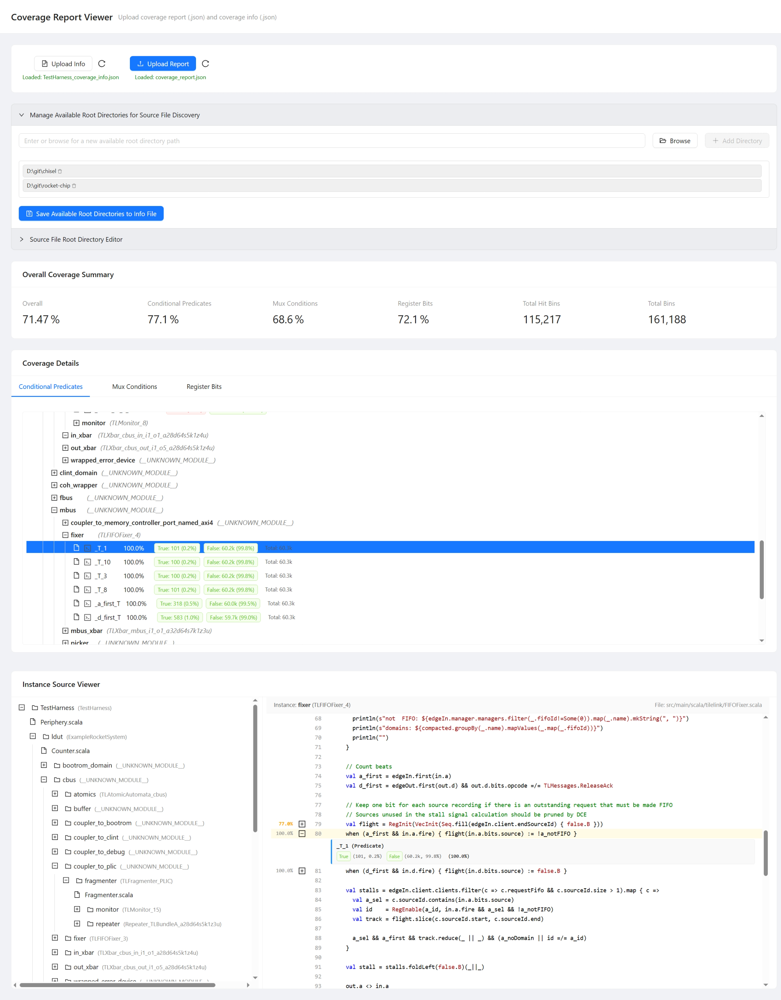

# Chisel 覆盖率工具

## 项目简介

本项目提供了一个基于 Chisel 和 FIRRTL 的工具，用于自动提取 Chisel 设计中的特定覆盖点（目前支持 `when`/`else when` 语句的谓词、`Mux` 表达式的条件以及所有寄存器的值），并将这些信号传播到顶层模块。然后，它会生成配套的覆盖点信息 json, C++ 代码和一个 Bash 脚本，以便使用 Verilator 进行仿真，并在仿真过程中收集这些覆盖点的信息，最终生成覆盖率报告（控制台输出和 JSON 文件）。

## 功能对比

| **对比维度**     | **Chisel (硬件构造语言)**                                                | **Verilator (仿真工具)**                                           | **Chisel Coverage Tool**                                                                                        |
| ---------------- | ------------------------------------------------------------------------ | ------------------------------------------------------------------ | --------------------------------------------------------------------------------------------------------------- |
| **核心功能**     | 基于 Scala 的 RTL 生成框架，支持硬件抽象设计与参数化模块构造             | 将 Verilog 转换为优化的 C++ 仿真模型，提供高性能仿真能力           | 通过 FIRRTL 转换自动提取 Chisel 设计中的条件分支、Mux 路径和寄存器信号，并生成 cpp 测试框架注入覆盖率探针       |
| **覆盖类型**     | 依赖 sbt-scoverage 插件统计 Scala 生成器代码覆盖率，与硬件逻辑无直接关联 | 支持 SystemVerilog 代码行覆盖率（Line Coverage），反映代码执行频率 | 硬件行为级功能覆盖率：<br>• 条件分支命中率（True/False）<br>• Mux 路径选择率<br>• 寄存器位级翻转统计            |
| **验证流程整合** | 无法验证 RTL 设计的覆盖率                                                | 生成 .dat 覆盖率文件，需配合 lcov/genhtml 等工具二次解析           | 全流程自动化：<br>• 生成带覆盖率端口的 SystemVerilog<br>• 集成 C++ 覆盖率收集框架<br>• 一键生成报告与树状可视化 |
| **验证效率瓶颈** | 覆盖率与 RTL 设计无关，无法定位硬件控制流缺陷                            | 行覆盖率无法识别未触发的状态机跳转、多路选择器路径等硬件关键行为   | 基于硬件语义的覆盖率模型可直接暴露设计漏洞（如死锁分支、未使用寄存器位等）                                      |

## 使用说明

1.  **准备 Chisel 模块**: 确保你的 Chisel 模块可以被实例化（例如，继承自 `RawModule` 或 `Module`）。
2.  **配置主程序**: 参考下面的示例代码，在 `main.scala` (或其他主程序文件) 中：
    - 定义一个 `Seq`，包含要处理的模块生成器函数和对应的输出子目录名称。
    - 遍历这个 `Seq`，对每个模块调用 `CoverageUtil.processModule`。
    - `CoverageUtil.processModule` 参数说明：
      - `moduleGenerator`: 一个返回 `RawModule` 实例的函数 (例如 `() => new MyModule()`)。
      - `outputDir`: 指定该模块所有输出文件的根目录。
      - `enableDevOutput`: (可选, 默认为 `false`) 如果设置为 `true`，会在 `outputDir` 下创建一个 `dev` 子目录，并生成额外的调试文件，如转换前的 FIRRTL (`old.fir`)、转换后的 FIRRTL (`new.fir`) 和转换前的 SystemVerilog (`old.sv`)。
      - `firtoolOpts`: (可选) 传递给 `firtool` (用于生成 SystemVerilog) 的额外参数。
3.  **运行主程序**: 在 IDE (如 Visual Studio Code) 中运行包含 `ExampleMain` (或你的主程序对象) 的 Scala 文件。
4.  **检查输出**: 程序执行完毕后，会在指定的 `outputDir` (例如 `output_generated/uart_rx`) 下生成以下文件和目录：
    - `<TopModuleName>.sv`: 经过转换、带有覆盖率信号导出端口的 SystemVerilog 文件。
    - `coverage.bash`: 用于编译和运行 Verilator 仿真的 Bash 脚本。
    - `obj_dir/`: Verilator 的工作目录。
      - `coverage_collector.h`: 包含覆盖点数据结构和收集逻辑的 C++ 头文件。
      - `sim_main.cpp`: Verilator 仿真的 C++ 主程序框架。
    - `dev/` (如果 `enableDevOutput` 为 `true`):
      - `old.fir`: 原始 FIRRTL 代码。
      - `new.fir`: 转换后的 FIRRTL 代码。
      - `old.sv`: 原始 SystemVerilog 代码。
5.  **运行仿真和收集覆盖率**:
    - 打开终端或 Git Bash。
    - `cd` 到包含 `coverage.bash` 的 `outputDir` 目录 (例如 `cd output_generated/uart_rx`)。
    - 确保你的环境安装了 Verilator 和 C++ 编译器 (如 g++)。
    - 执行 `./coverage.bash generate` 来编译 Verilog 代码生成 C++ 模型。
    - 手动编辑 `obj_dir/sim_main.cpp` 文件，在仿真循环中添加你的测试激励逻辑。根据你的设计需求，编写 C++ 代码来驱动 DUT 的输入端口。
    - 执行 `./coverage.bash run` 来编译 C++ 代码（包含你添加的激励）并运行仿真。
    - 仿真结束后，会在当前目录 (即 `outputDir`) 生成 `coverage_report.json` 文件，并在控制台打印覆盖率摘要。同时，在 `obj_dir` 目录下会生成 `waveform.vcd` 文件。

## 示例代码

以下是 `src/main/scala/main.scala` 中的示例，展示了如何使用 `CoverageUtil` 处理多个模块：

```scala
package main

import circt.stage.CustomStage
import file_util.FileUtil
import java.io.File
import circt.stage.ChiselStage
import chisel3.RawModule
import modules.WaveformGenerator
import modules.UART_rx
import modules.UART_tx
import chisel3.Reg
import modules.RegModule
import modules.ComplexExample
import firrtl.ir.CoverageTool
import org.chipsalliance.cde.config.{Parameters, Config, Field}
import freechips.rocketchip.rocket._
import freechips.rocketchip.rocket.ALU._
import freechips.rocketchip.util._
import _root_.circt.stage.ChiselStage
import freechips.rocketchip.system.DefaultConfig
import freechips.rocketchip.tile.{RocketTileParams, TileKey, LookupByHartIdImpl}
import freechips.rocketchip.tile.RocketTile
import org.chipsalliance.diplomacy.lazymodule.LazyModule
import freechips.rocketchip.system.ExampleRocketSystem
import freechips.rocketchip.system.TestHarness

object Main {
  def main(args: Array[String]): Unit = {
    implicit val p: Parameters = new DefaultConfig()
    val baseOutputDir = "output_generated"

    val modulesToProcess: Seq[(() => RawModule, String)] = Seq(
      (
        () => new WaveformGenerator,
        "waveform_generator"
      ),
      (
        () => new UART_rx(),
        "uart_rx"
      ),
      (
        () => new UART_tx(),
        "uart_tx"
      ),
      (() => new RegModule(), "reg_module"),
      (() => new ComplexExample(), "complex_example"),
      // RocketChip
      (
        () => new TestHarness(),
        "rocket_test_harness"
      )
    )

    modulesToProcess.foreach { case (moduleGenerator, outputSubDir) =>
      val outputDir = s"$baseOutputDir/$outputSubDir"
      CoverageTool.processModule(
        moduleGenerator = moduleGenerator,
        outputDir = outputDir,
        enableDevOutput = true
      )
    }
    println("所有模块处理完毕.")

  }
}
```

## 覆盖率结果分析工具 (Tauri + Vue3)

项目包含一个简单的桌面应用程序 (`analysis_app` 目录)，用于可视化`coverage_info.json` 和 `coverage_report.json` 文件中的覆盖率结果, 可以以实例树的层次查看所有的覆盖点和源代码, 快速导航和分析覆盖率问题。

### 运行

1.  确保你的开发环境安装了 Node.js 和 Rust (Tauri 开发所需)。
2.  进入 `analysis_app` 目录: `cd analysis_app`
3.  安装依赖: `pnpm install`
4.  启动开发服务器: `pnpm run tauri dev`
5.  应用程序启动后，上传你的`coverage_info.json` 和 `coverage_report.json` 文件即可查看。



## Rocket Chip集成
通过将 `CoverageTool` 集成到 Rocket Chip 的 `TestHarness` 中，可以实现对整个 SoC 设计的覆盖率分析, 并且使用elf作为测试激励。

`output_generated/rocket_test_harness/emulator` 目录下包含了一个继承了chisel coverage tool完整的 Rocket chip TestHarness emulator的源代码、CmakeLists文件和一个在ubuntu24 wsl2上构建的emulator程序。

emulator是一个命令行工具:

```text
Usage: ./emulator [EMULATOR OPTION]... [VERILOG PLUSARG]... [HOST OPTION]... BINARY [TARGET OPTION]...
Run a BINARY on the Rocket Chip emulator.

Mandatory arguments to long options are mandatory for short options too.

EMULATOR OPTIONS
  -c, --cycle-count        Print the cycle count before exiting
       +cycle-count
......
```

同时运行elf结束后, 将会打印覆盖率信息, 并导出`coverage_report.json`文件来用于分析使用。